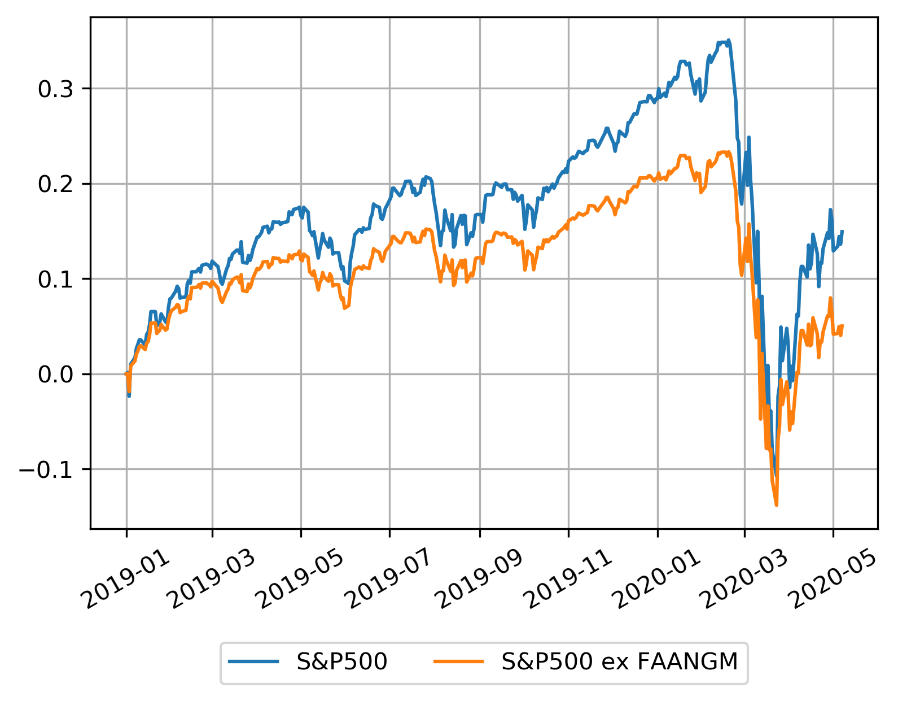

# SP500-ex-FAANG
 \- as of May 2020 -
Simple notebook calculating the S&P500 returns if the biggest tech companies are not included. Subsample January 2019 - May 2020, especially interested in the March 2020 covid crash and the recovery of tech. 
Data obtained from Datastream, tech companies exluded from the S&P500 Index are Facebook, Amazon, Apple, Netflix, Alphabet, Microsoft. 

